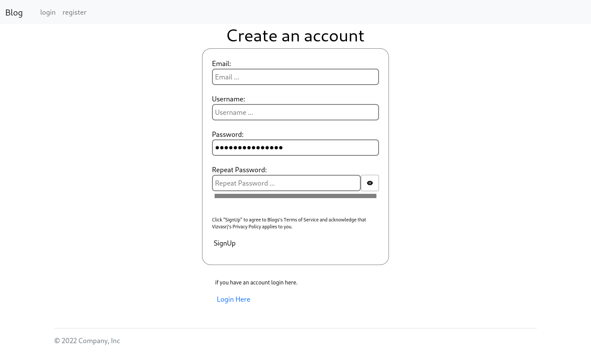
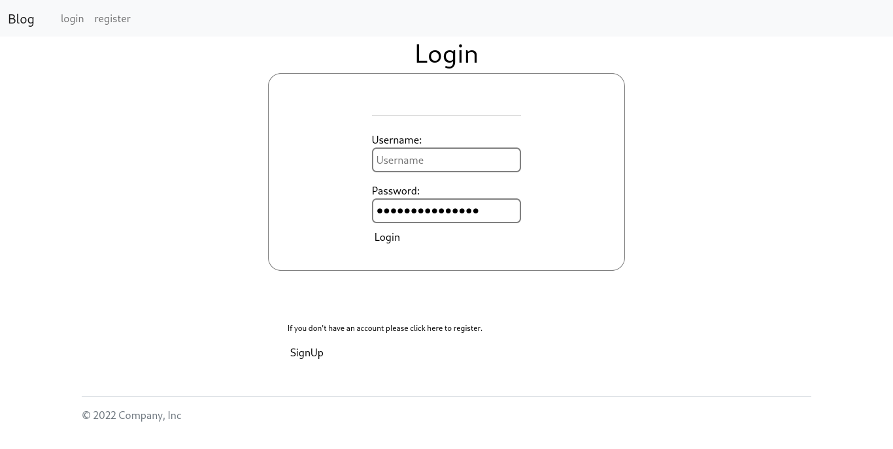
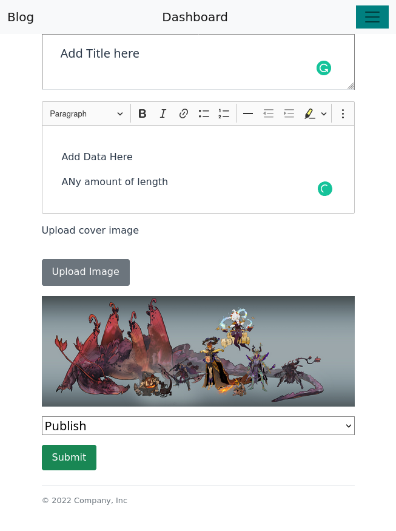
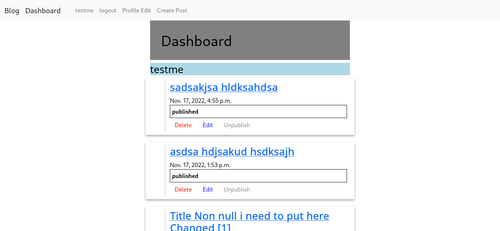

https://demo-blog-dx0g.onrender.com/
Installation process

```bash
git clone https://github.com/vizvasrj/blog
```

```bash
cd blog
python3 -m venv ../zoo/blog
pip install -r requirements.txt
./manage.py runserver
```

http://127.0.0.1:8000/ will be address which you need to get connect,

# Features

* To Register click on http://127.0.0.1:8000/accounts/register/

  
* Login http://127.0.0.1:8000/accounts/login/
* 

  ---
* Create Blog Post using `Create Post` Button from NavBar
* # 
* # Dashboard
* Edit, Delete, Unpublish, Publish, List your all post.

  

  ---
